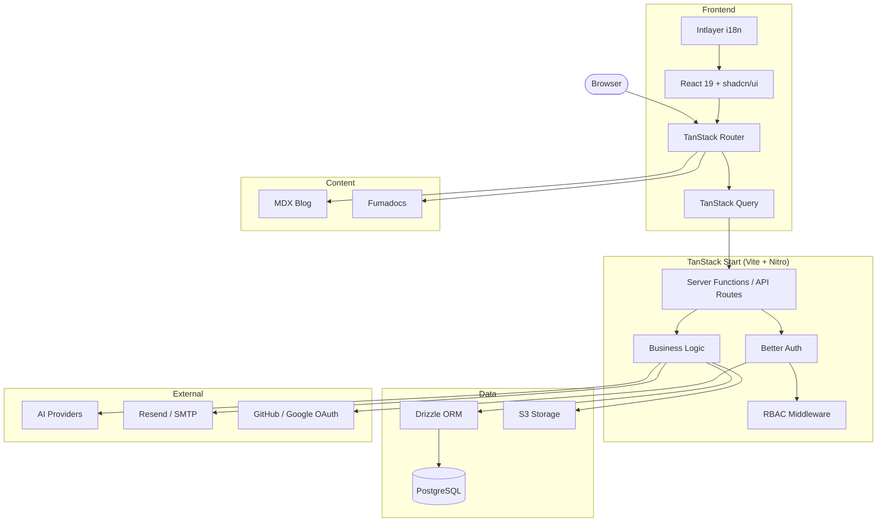

<p align="center">
  
</p>
<h1 align="center">VibeAny</h1>
<p align="center">
  <a href="./README.zh-CN.md">中文</a> | <a href="./README.md">English</a>
</p>
<p align="center">
  Full-stack starter for building AI-powered web apps with TanStack Start.<br />
  Ships with authentication, database, landing page, blog, docs, i18n, admin panel, and more — ready to deploy in minutes.
</p>
<p align="center">
  <a href="LICENSE"></a>
  <a href="https://github.com/jiahao-jayden/vibe-any-tanstack/stargazers"></a>
  <a href="https://github.com/jiahao-jayden/vibe-any-tanstack/issues"></a>
  <a href="https://discord.gg/FQ2TAHh6"></a>
</p>
<p align="center">
  <a href="https://youtu.be/0DqfKBenvkQ">
    
  </a>
  <a href="https://vibeany.dev/docs">
    
  </a>
</p>
<p align="center">
  <a href="https://youtu.be/0DqfKBenvkQ">
    
  </a>
</p>

## Features

- **TanStack Start** — File-based routing, SSR, server functions
- **Authentication** — Email/password, Google, GitHub OAuth, magic links (Better Auth)
- **Database** — PostgreSQL with Drizzle ORM, type-safe schema and migrations
- **RBAC** — Role-based access control with permission inheritance
- **Landing Page** — Hero, features, benefits, testimonials, FAQ, CTA sections
- **Blog & Docs** — MDX-powered blog and Fumadocs documentation, multilingual
- **Changelog & Roadmap** — Product changelog timeline and visual roadmap board
- **Admin Panel** — User management, system configuration, role management
- **Internationalization** — English and Chinese out of the box (Intlayer)
- **Email** — Verification and magic link emails via Resend or custom SMTP
- **File Storage** — S3-compatible upload (Cloudflare R2, AWS S3, MinIO)
- **AI Chat** — Chat interface with Vercel AI SDK, supports 100+ models
- **UI** — Tailwind CSS v4, shadcn/ui, Radix primitives, Lucide icons
- **Theme** — Light / dark / system with one-click toggle

## Architecture



## Tech Stack

| Layer | Technology |
|-------|-----------|
| Framework | TanStack Start + React 19 + Vite |
| Routing | TanStack Router (file-based) |
| Data Fetching | TanStack Query |
| Database | PostgreSQL + Drizzle ORM |
| Auth | Better Auth |
| Styling | Tailwind CSS v4 + shadcn/ui |
| i18n | Intlayer |
| Content | Fumadocs (docs) + MDX (blog) |
| Email | Resend / Nodemailer |
| Validation | Zod |
| Linting | Biome |

## Quick Start

### Prerequisites

- Node.js 20+
- pnpm 9+
- PostgreSQL database

### 1. Clone and install

```bash
git clone https://github.com/jiahao-jayden/vibe-any-tanstack.git
cd vibe-any
pnpm install
```

### 2. Configure environment

```bash
cp .env.example .env.local
```

The app runs in **static mode** with zero configuration — landing page, blog, and docs work without a database. To enable auth and user features, set `DATABASE_URL` and `BETTER_AUTH_SECRET`.

### 3. Set up database (optional)

```bash
pnpm db:push
```

### 4. Start development

```bash
pnpm dev
```

Open [http://localhost:3377](http://localhost:3377).

## Project Structure

```
src/
├── actions/          # Server actions
├── config/           # Site config, i18n content, dynamic config
├── db/               # Drizzle schema (auth, config, RBAC)
├── integrations/     # RBAC checker, storage, TanStack Query, AI
├── routes/
│   ├── api/          # API routes (auth, admin, file upload)
│   └── {-$locale}/   # Page routes with i18n prefix
│       ├── _main/
│       │   ├── _landing/   # Landing pages (home, blog, changelog, etc.)
│       │   ├── admin/      # Admin panel
│       │   └── chat/       # AI chat
│       ├── docs/     # Documentation
│       └── login/    # Login page
├── services/         # Business logic
└── shared/
    ├── components/   # UI components
    ├── context/      # React context (global state)
    ├── hooks/        # Custom hooks
    ├── lib/          # Utilities (auth, email, config, tools)
    ├── middleware/    # Route middleware (auth, locale)
    ├── model/        # Database query functions
    └── types/        # TypeScript types
```

## Configuration

All features are opt-in through environment variables:

| Feature | Required Variables |
|---------|-------------------|
| Database | `DATABASE_URL` |
| Auth | `DATABASE_URL` + `BETTER_AUTH_SECRET` |
| GitHub OAuth | `GITHUB_CLIENT_ID` + `GITHUB_CLIENT_SECRET` |
| Google OAuth | `GOOGLE_CLIENT_ID` + `GOOGLE_CLIENT_SECRET` |
| Email | `EMAIL_PROVIDER` + `EMAIL_FROM` + provider keys |
| Storage | `STORAGE_*` variables |
| Captcha | `VITE_TURNSTILE_*` + `TURNSTILE_SECRET_KEY` |

See [`.env.example`](.env.example) for the full list.

## Scripts

```bash
pnpm dev          # Start dev server on port 3377
pnpm build        # Production build
pnpm preview      # Preview production build
pnpm db:generate  # Generate Drizzle migrations
pnpm db:push      # Push schema to database
pnpm db:migrate   # Run migrations
pnpm db:studio    # Open Drizzle Studio
pnpm rbac         # Manage RBAC roles and permissions
pnpm lint         # Lint with Biome
pnpm format       # Format with Biome
pnpm test         # Run tests with Vitest
```

## Deployment

Build and run:

```bash
pnpm build
node .output/server/index.mjs
```

Works with any Node.js hosting — Vercel, Railway, Fly.io, VPS, Docker, etc.

## Contributing

Contributions are welcome. Please open an issue first to discuss what you'd like to change.

## License

[Apache License 2.0](LICENSE)
